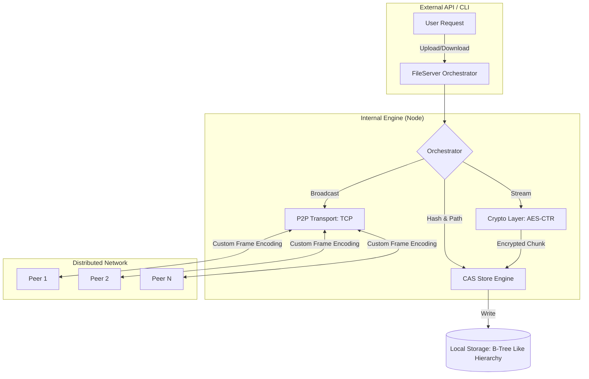

# Distributed-File-Storage-System

[](https://golang.org/)
[](LICENSE)
[]()

**Distributed-File-Storage-System** is a high-performance, decentralized file storage infrastructure engineered in Go. It solves the core challenges of peer-to-peer data distribution by harmonizing **Content-Addressable Storage (CAS)**, **Custom Wire Protocols**, and **Streaming Cryptography**.

Designed with **Google-tier engineering principles**, this system minimizes memory overhead while maximizing data integrity and security across a decentralized cluster.

---

## 🏗️ System Architecture

Our architecture focuses on low-latency, stateless coordination.



---

## 📚 Detailed Documentation

For a deep dive into the engineering specifics, explore our technical specifications:

- **[Architecture Specification](docs/ARCHITECTURE.md)**: Deep dive into distributed state, design philosophy, and concurrency models.
- **[Wire Protocol Specification](docs/PROTOCOL.md)**: Details on the custom TCP frame structure and non-blocking decoder logic.
- **[Security & Crypto Specification](docs/SECURITY.md)**: Mathematical details of the AES-CTR streaming encryption and IV management.

---

## 🚀 Key Engineering Pillars

### 1. Mathematical Content-Addressability (CAS)
We treat data as its own address via SHA1 hashing. This provides **implicit deduplication** and **inherent integrity verification**. If a file is modified, its address changes, making tampering impossible to hide.

### 2. High-Efficiency Streaming Protocol
Unlike traditional P2P systems that buffer entire files, our custom TCP protocol supports **Multiplexed Streaming**. We use a single-byte prefixing strategy to switch between control messages and raw binary data on the same wire, achieving $O(1)$ memory complexity regardless of file size.

### 3. Balanced Storage Hierarchy
To prevent OS-level performance degradation, we implement a path transformation algorithm that distributes millions of files into a balanced subdirectory tree, preventing "dense folder" bottlenecks.

### 4. End-to-End Streaming Security
Files are never stored or transmitted in plain text. We utilize **AES-256 CTR** for streaming encryption, ensuring that every file segment is secure from the moment it leaves the source until it is persisted on a remote disk.

---

## 🚦 Getting Started

### Prerequisites
- Go 1.26 or higher.

### Quick Start (Multi-Node Simulation)
The project includes a built-in simulation environment.
```bash
# Clone and build
git clone https://github.com/ibesuperv/Distributed-File-Storage-System
cd Distributed-File-Storage-System
go build -o bin/dfs

# Upload a file (Will trigger broadcast and replication)
make run ARGS="-u test_files/audio.mpeg"

# Download a file (Will trigger network-wide discovery)
make run ARGS="-d audio.mpeg"
```

---

## 🧪 Engineering Philosophy (The "Google" Way)

- **Scalability**: Designed to handle arbitrarily large files without RAM spikes.
- **Resilience**: A decentralized "Shared Nothing" architecture where any node can fail without data loss.
- **Observability**: Consistent logging and clear separation of transport vs. storage concerns.
- **Reliability**: Self-correcting stream logic with WaitGroup-based synchronization.

---

## 🤝 Contributing
Contributions are welcome! Please see [CONTRIBUTING.md](CONTRIBUTING.md) for details on our code of conduct and the process for submitting pull requests.
