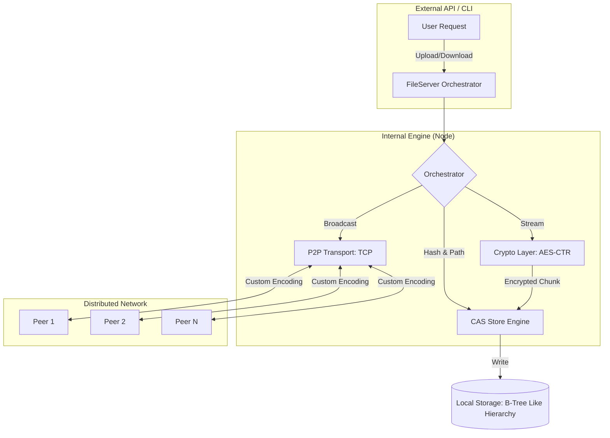

# Distributed-File-Storage-System

[](https://golang.org/)
[](LICENSE)
[]()

**Distributed-File-Storage-System** is a high-performance, decentralized file storage infrastructure engineered in Go. It solves the "Large File" problem in peer-to-peer networks by combining **Content-Addressable Storage (CAS)**, **Custom TCP Transport**, and **Streaming Cryptography** into a single, cohesive engine.

Designed for scalability and resilience, this system eliminates the need for central authority while providing industrial-grade data integrity and security.

---

## 🏗️ System Architecture

The following diagram illustrates the lifecycle of a file within the network, from initial ingestion to distributed persistence.



---

## 🚀 Deep Technical Pillars

### 1. Content-Addressable Storage (CAS)
Traditional storage uses file paths (e.g., `/user/docs/cat.jpg`). This system uses **Mathematical Identity**.
- **How it works**: Every file is hashed using SHA1. The resulting hash *is* the file's address.
- **Why it matters**: 
    - **Deduplication**: If 100 people upload the same movie, the network only stores one copy.
    - **Integrity**: The address itself is a checksum. If a single bit of the file changes, its address becomes invalid.
- **Hierarchical Pathing**: To prevent directory performance bottlenecks (storing 1,000,000 files in one folder), the system slices the hash into a balanced directory tree (e.g., `a1b2c/3d4e5/f6...`).

### 2. The Custom P2P Protocol
Instead of relying on heavy HTTP headers, we implemented a custom TCP-based protocol.
- **Handshaking**: Pluggable handshake mechanism for node authentication.
- **Custom Frame Decoding**: Our `DefaultDecoder` peeks at the first byte of every packet. It differentiates between **Control Messages** (small JSON-like GOB data) and **Raw Binary Streams** (multi-gigabyte files).
- **Non-Blocking I/O**: The transport uses Go's concurrency primitives (Goroutines and Channels) to handle thousands of concurrent peer connections without thread exhaustion.

### 3. Handling "Massive" Files
Unlike systems that load files into RAM, this system treats everything as a **Stream**.
- **`io.Reader` Pipeline**: From the moment a file enters the network, it is piped through the crypto engine and into the storage engine bit-by-bit.
- **Memory Footprint**: Whether you store a 1KB text file or a 100GB 4K video, the RAM usage of the node remains low and constant.

### 4. End-to-End Security
- **AES-CTR (Counter Mode)**: We use AES-256 in Counter Mode, which is optimal for streaming data. It allows for random access (if needed) and ensures no two encrypted files look the same, even if original contents are identical.
- **Unique IVs**: Every file transaction generates a cryptographically secure 16-byte Initial Vector (IV), which is prepended to the data.

---

## 🛠️ Performance & Scalability

- **Zero-Copy Intent**: Utilizes `io.Copy` extensively to leverage kernel-level optimizations.
- **Broadcast Propagation**: Uses an efficient broadcast mechanism to ensure data availability across all bootstrap nodes.
- **Local Cache**: Every node acts as a cache for the network, serving files it already possesses via local CAS lookup.

---

## 🚦 Installation & Getting Started

### 1. Clone & Build
```bash
git clone https://github.com/your-username/Distributed-File-Storage-System
cd Distributed-File-Storage-System
go build -o bin/dfs
```

### 2. Run the Multi-Node Simulation
The system is designed to run multiple nodes locally for testing.
```bash
# Node 1 starts on :3000
# Node 2 starts on :7000
# Node 3 starts on :5000 and connects to the others

# Simple Upload command
make run ARGS="-u path/to/large_video.mp4"
```

### 3. Verification
After an upload, you will see the system:
1. Hash the file.
2. Encrypt it with a unique salt.
3. Distribute it to peers.
4. Verify the integrity by downloading it back into `./recovred_files/`.

---

## 📈 SDE Portfolio Highlights
This project demonstrates expertise in:
- **Low-level Systems Programming**: Direct TCP socket management and custom protocol design.
- **Distributed Consensus**: Understanding of node coordination and data availability.
- **Advanced Go Patterns**: Heavy use of Interfaces, WaitGroups, Mutexes, and custom `io` Wrappers.
- **Security Engineering**: Implementation of industry-standard cryptographic primitives.
