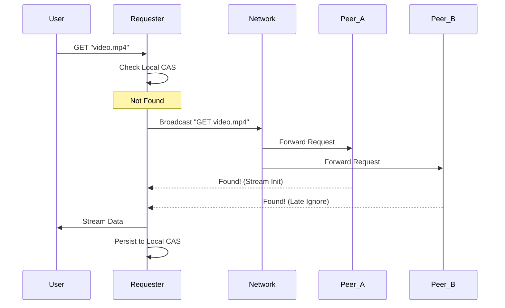

# System Architecture Specification

This document details the design patterns, state management, and orchestration logic of the **Distributed-File-Storage-System**.

## 1. Design Philosophy

The system is built on the principle of **Stateless Peer Coordination**. Unlike centralized systems that rely on a single source of truth for file locations, every node in this network is an equal citizen capable of indexing, storing, and serving any piece of data.

### Core Principles:
- **Streaming by Default**: Memory is a precious resource. All data must flow through the system as a stream to maintain a O(1) memory footprint relative to file size.
- **Content-Addressability**: The data defines its own address. This provides inherent deduplication and self-verifying integrity.
- **Layered Decoupling**: The networking (P2P), logic (Server), and persistence (Store) layers communicate via clean interfaces, allowing for protocol swaps (e.g., swapping TCP for UDP) without touching business logic.

---

## 2. Distributed State Management

The "State" of the network consists of which peer has which file. We manage this through **Reactive Broadcast Discovery**.

### The "Get" Sequence
When a node requests a file:
1. **Local Check**: The node queries its own `Store` (CAS lookup).
2. **Network Broadcast**: If missing, it broadcasts a `MessageGetFile` to all connected peers.
3. **Peer Search**: Each receiving peer checks their local `Store`.
4. **Stream Initiation**: The first peer to find the file opens a direct stream to the requester.
5. **Caching**: The requester stores the file locally, becoming a new source for that data.

---

## 3. Storage Hierarchy (The CAS Store)

To ensure OS-level reliability when storing millions of files, we implement a hierarchical path transformation.

### Path Transformation Logic:
A key `cat.jpg` might hash to `3a4f...`. Instead of storing it in a flat folder:
1. The hash is divided into blocks (default 5 characters).
2. A directory tree is built: `3a4f7/1b2c3/4d5e6/3a4f71b2c34d5e6...`
3. This ensures that no single directory ever contains more than a manageable number of entries, preventing filesystem performance degradation.

---

## 4. Concurrency Model

The system utilizes Go's **Communicating Sequential Processes (CSP)** model:
- **Goroutines**: Every peer connection runs in its own lightweight goroutine.
- **Channels**: The `Transport` layer exposes a `Consume()` channel, allowing the `Server` to process incoming RPCs sequentially or concurrently without complex lock management.
- **WaitGroups**: Used to synchronize the completion of multi-node broadcasts and stream closures.
